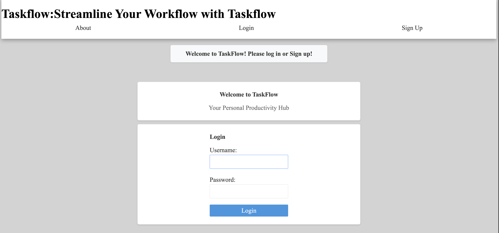

# TaskFlow : Weekly Planner for Streamlined Task Management 

# Project name: Taskflow weekly Planner 

## What is this? 
This is a weekly planner designed to help you organize your tasks more efficiently. It offers three key features:

1. ***All tasks view with search bar***:\
The central hub for all your tasks, both past and future. Use the search bar to quickly find specific tasks, whether they are upcoming or have already been completed.

2. ***Weekly View***:\
A snapshot of your week, showing your tasks organized by day. You can easily navigate between different weeks and jump back to the current week with a single click.

3. ***Tags***:\
Tags help you categorize your tasks based on their type or purpose. For example, you can create a “Gym” tag and assign it to related tasks. Tags are fully customizable, and each tag is color-coded for easy organization.

## How to use it?
You can begin by navigating to the "Add a Task" link to create tasks, or you can go directly to the Weekly View and start adding tasks there. All tasks will automatically appear in the "All Tasks" view. If you ever need to review what’s been done, simply use the search bar to quickly find and check your tasks.

## Why I chose this as my project?
I currently use Notion as my weekly task manager. While Notion is powerful, it can be overwhelming for beginners because it requires knowledge of creating databases, templates, and linking them together. Though you can find great templates, they’re often not free and can be difficult to customize. This new digital tool is much more user-friendly, allowing you to quickly start creating and organizing tasks without any complicated setup. You can jump right in and begin assigning tasks to organize your day with ease.

## Getting started
[Deployed app link](https://taskflow-kuix.onrender.com/)\
[Planning app link (trello)](https://trello.com/b/1pJFy39q/task-flow)

## Attributions: 
[Django documentation](https://docs.djangoproject.com/en/5.1/)

## Technology Used: 
**JavaScript**\
**CSS**\
**HTML**\
**Python**\
**Django**\
**PostgreSQL**\
**psycopg2-binary**\
**dj-database-url**\
**Gunicorn**\
**Uvicorn**\
**python-dotenv**

## Next steps(stretch goals):
1. I want to integrate AI through the OpenAI API to create a chatbot that can assist with task management:  The chatbot should be able to understand simple commands, like "Show me all tasks for Tuesday" or "Plan dinner for next Friday." It should be able to perform necessary CRUD (Create, Read, Update, Delete) operations, such as adding, viewing, editing, and removing tasks, all through conversational commands.

2. Implement a daily and monthly view: This will give users a clearer overview of how their day and month will unfold, helping them plan and manage their time more effectively.

3. Implement drag-and-drop functionality: This will enhance the user experience by making the app more intuitive and easier to use.

4. Calendar Integration: Integrate with Google Calendar or other popular calendar apps to enable seamless synchronization of tasks and events.

5. Tag-Based Filtering: Implement a search feature that allows users to quickly filter tasks by tags, making it easier to organize and find tasks based on their categories.

## Web Accessibility

